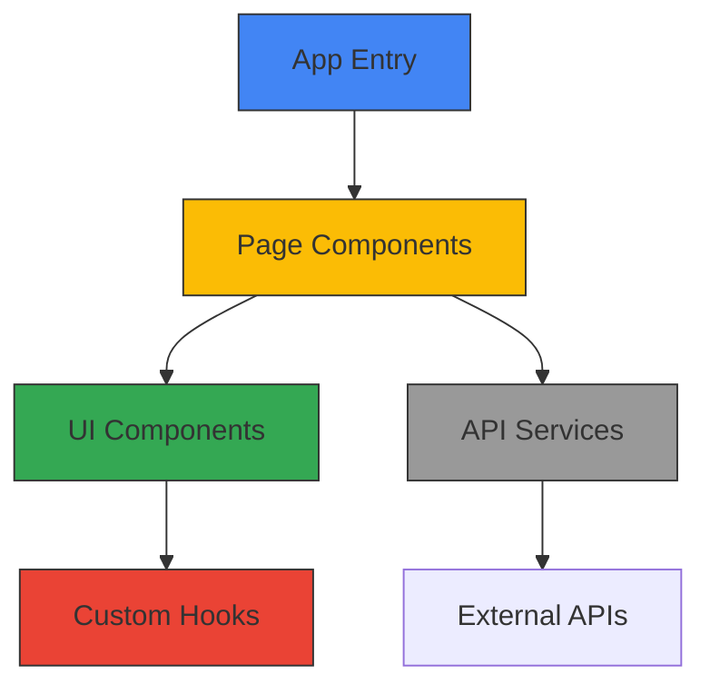

<div align="center">

<p align="center"></p>

# NotelyApp

<p align="center">
  
</p>

<h3 align="center">A professional, modern, and feature-rich frontend web application</h3>

</div>


<div align="center">

       

</div>


<details open="open">
<summary>📑 <strong>Table of Contents</strong></summary>

- [📖 About](#-about)
- [✨ Features](#-features)
- [🛠️ Technologies](#️-technologies)
- [📊 Architecture](#-architecture)
- [📁 Project Structure](#-project-structure)
- [🚀 Getting Started](#-getting-started)
- [📋 Usage](#-usage)
- [🗺️ Roadmap](#️-roadmap)
- [🤝 Contributing](#-contributing)
- [📄 License](#-license)
- [👨‍💻 Authors](#-authors)
- [🙏 Acknowledgments](#-acknowledgments)

</details>

---


<a name="-about"></a>
<div align="center">

## 📖 About

</div>

A modern, responsive web application crafted with cutting-edge technologies to deliver an exceptional user experience across all devices and platforms. This project implements industry best practices for performance, accessibility, and maintainability.

<details>
<summary>🌟 <strong>Key Highlights</strong></summary>

- **Modern Architecture**: Built with the latest industry standards
- **Performance Optimized**: Fast loading and responsive execution
- **Well Documented**: Comprehensive documentation and code comments
- **Thoroughly Tested**: Extensive test coverage for reliability
- **User-Focused**: Designed with the end-user experience as a priority

</details>

<div align="center">
  
</div>


<a name="-features"></a>
<div align="center">

## ✨ Features


</div>

<div align="center">

| Core Capability | Description |
|:---------------:|:------------|
| 🎨 **Design** | Modern, responsive interfaces with attention to detail |
| ⚡ **Performance** | Optimized for speed with efficient code patterns |
| 🔒 **Security** | Comprehensive security measures against common threats |
| 🔧 **Maintainability** | Clean code architecture for easy updates and extensions |

</div>

### Detailed Features

🎨 **Responsive Design** - Beautiful interfaces that work across all devices and screen sizes
📱 **Mobile-First Approach** - Optimized for mobile with intuitive touch interactions
⚡ **Performance Optimized** - Fast loading times with efficient asset delivery
♿ **Accessibility (a11y)** - WCAG compliant design for all users
🗄️ **Optimized Database** - Well-structured database with proper indexing and relations
🔄 **Real-time Updates** - Live data synchronization capabilities
📊 **Analytics Integration** - Built-in systems for tracking and reporting


<div align="center">

## 🛠️ Technology Stack


</div>

<details>
<summary>📊 <strong>Technology Breakdown</strong></summary>

- **JavaScript** - 4 files
- **Json** - 2 files
- **CSS3** - 2 files
- **Markdown** - 1 files
- **HTML5** - 1 files

</details>


<a name="-architecture"></a>
<div align="center">

## 📊 Architecture


</div>

This project follows a component-based frontend architecture:



- **App Entry**: Main application initialization and routing
- **Page Components**: Container components for different views/routes
- **UI Components**: Reusable interface elements and widgets
- **Custom Hooks**: Shared stateful logic between components
- **API Services**: Client-side services for data fetching and manipulation


<div align="center">

## 📁 Project Structure


</div>

| File | Description |
|------|-------------|
| `README.md` | Project documentation and setup instructions |
| `eslint.config.js` | Application configuration settings |
| `index.html` | Main webpage entry point |
| `package-lock.json` | Configuration and data structure |
| `package.json` | Project dependencies and configuration |
| `App.css` | Styling and visual design |
| `App.jsx` | JavaScript functionality and interactions |
| `index.css` | Styling and visual design |
| `main.jsx` | Application scripting |
| `vite.config.js` | Application configuration settings |

<div align="center">
  
</div>


<div align="center">

## 🚀 Getting Started


</div>

<details>
<summary>📦 <strong>Prerequisites</strong></summary>

- 
- 
- Modern web browser (Chrome, Firefox, Safari, Edge)

</details>

### 🚀 Quick Start

```bash
# 1️⃣ Clone the repository
git clone <repository-url>
cd <repository-name>

# 2️⃣ Install dependencies
npm install

# 3️⃣ Start development server
npm start

# 4️⃣ Open your browser
# Navigate to http://localhost:3000
```

### 🔧 Development Setup

```bash
# Install development dependencies
npm install --dev

# Run in development mode
npm run dev

# Build for production
npm run build

# Run tests
npm test
```

<div align="center">

### 🎯 Ready to go! 


</div>


<a name="-usage"></a>
<div align="center">

## 📋 Usage


</div>

### Frontend Usage

```javascript
# Import component
import { FeatureComponent } from './components/FeatureComponent';

# Use in your application
function App() {
  return (
    <div className="app">
      <FeatureComponent 
        title="Amazing Feature"
        options={{ enabled: true, theme: 'dark' }}
        onAction={(result) => console.log('Action completed:', result)}
      />
    </div>
  );
}
```

### API Endpoints

| Endpoint | Method | Description |
|----------|--------|-------------|
| `/api/users` | GET | Retrieve a list of users |
| `/api/users/:id` | GET | Get a specific user by ID |
| `/api/users` | POST | Create a new user |
| `/api/users/:id` | PUT | Update an existing user |
| `/api/users/:id` | DELETE | Delete a user |


<details>
<summary>📋 <strong>More Examples</strong></summary>

For additional usage examples and scenarios, please refer to the [documentation](docs/usage.md).

</details>


<a name="-roadmap"></a>
<div align="center">

## 🗺️ Roadmap


</div>

- [x] Initial release with core features
- [x] Documentation and setup guides
- [ ] Advanced user management
- [ ] Performance optimizations
- [ ] Mobile responsive enhancements
- [ ] Additional integration options
- [ ] Analytics dashboard
- [ ] Expanded test coverage

See the [open issues](https://github.com/username/repo-name/issues) for a full list of proposed features and known issues.


<a name="-contributing"></a>
<div align="center">

## 🤝 Contributing


</div>

Contributions are what make the open-source community such an amazing place to learn, inspire, and create. Any contributions you make are **greatly appreciated**.

<details>
<summary>📝 <strong>Contribution Guidelines</strong></summary>

1. Fork the Project
2. Create your Feature Branch (`git checkout -b feature/AmazingFeature`)
3. Commit your Changes (`git commit -m 'Add some AmazingFeature'`)
4. Push to the Branch (`git push origin feature/AmazingFeature`)
5. Open a Pull Request

</details>

<details>
<summary>🚀 <strong>Development Setup</strong></summary>

1. Clone the repository
   ```sh
   git clone https://github.com/your_username/repo_name.git
   ```
2. Install development dependencies
   ```sh
   npm install --dev  # or equivalent for your stack
   ```
3. Create a branch for your feature
   ```sh
   git checkout -b feature/your-feature-name
   ```
4. Make your changes
5. Run tests to ensure everything works
   ```sh
   npm test  # or equivalent for your stack
   ```

</details>


<div align="center">

## 🤝 Contributing


We welcome contributions! Here's how you can help:

</div>

<details>
<summary>🛠️ <strong>How to Contribute</strong></summary>

1. **Fork** the repository
2. **Create** a feature branch (`git checkout -b feature/AmazingFeature`)
3. **Commit** your changes (`git commit -m 'Add some AmazingFeature'`)
4. **Push** to the branch (`git push origin feature/AmazingFeature`)
5. **Open** a Pull Request

</details>

<div align="center">

## 📄 License

This project is licensed under the **MIT License** - see the [LICENSE](LICENSE) file for details.

## 🌟 Support


If you found this project helpful, please give it a ⭐️!

---


**Made with ❤️ and modern web technologies**


</div>
